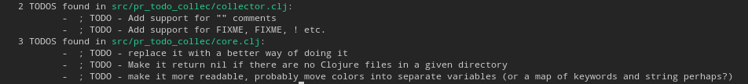

# SHOW TODOS

CLI app to find **TODOS** of your Clojure project

## Installation
Just download *show-todos.jar* from the bin directory

## Usage

    $ java -jar show-todos.jar <directory>

## Disclaimer
Since this is one of my first Clojure projects that I decided to publish, any
criticism is well welcome!

 

Copyright © 2021 Maciej Oliwa

This program and the accompanying materials are made available under the
terms of the Eclipse Public License 2.0 which is available at
http://www.eclipse.org/legal/epl-2.0.

This Source Code may also be made available under the following Secondary
Licenses when the conditions for such availability set forth in the Eclipse
Public License, v. 2.0 are satisfied: GNU General Public License as published by
the Free Software Foundation, either version 2 of the License, or (at your
option) any later version, with the GNU Classpath Exception which is available
at https://www.gnu.org/software/classpath/license.html.
